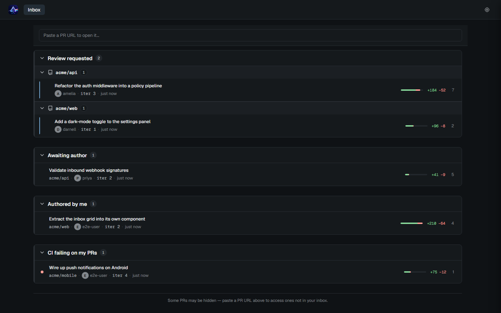
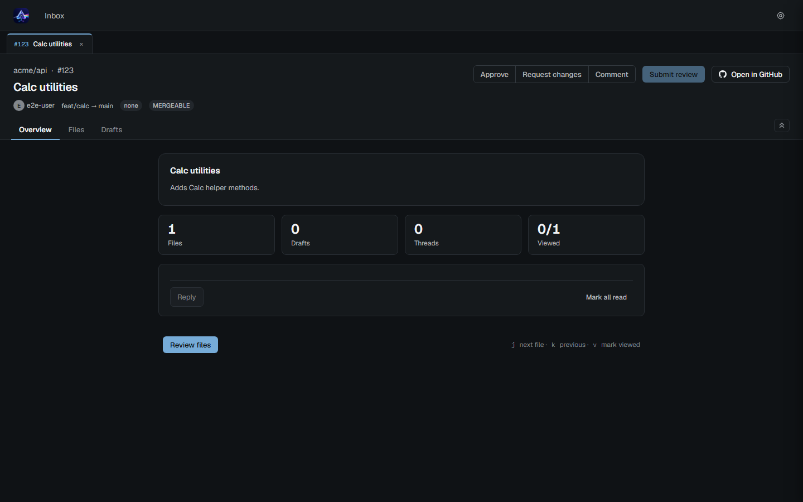
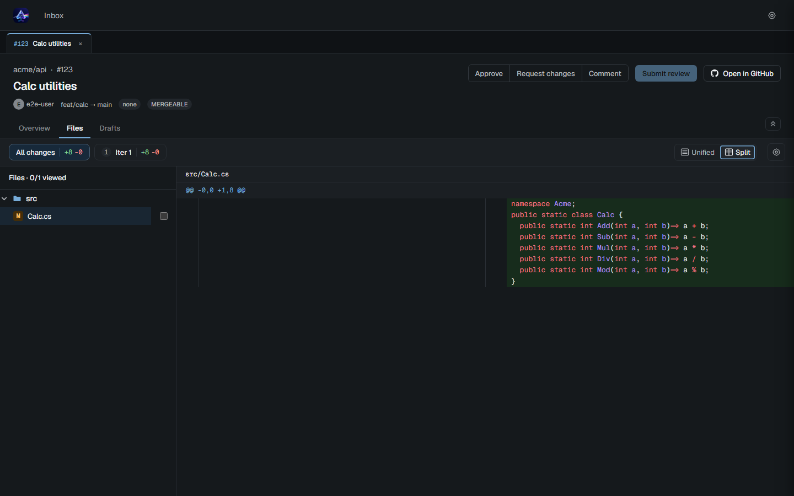

# PRism

**A local-first pull-request review tool that runs on your own machine.**

PRism reads your GitHub pull requests, lets you compose an entire review locally — line comments, replies, a verdict, and a summary — and finalizes everything together as a single GitHub *pending review*. Nothing you write is visible to anyone else until you click **Submit**, at which point the whole review lands at once, exactly as if you'd written it on github.com.

It runs entirely on your computer — there's no PRism server in the middle. The app talks directly to GitHub's API from your machine, and your drafts and view state stay local until you choose to submit a review.



> Screens shown with sample data.

---

## Why PRism

You're three files into a careful review when the author force-pushes. On github.com the diff shifts under you, your half-written comments now point at code that moved, and you're context-switching between the **Files** and **Conversation** tabs and the checks panel the whole time. PRism is built around a few deliberate choices that keep a review session calm:

- **Compose the whole review, then submit atomically.** Drafts, replies, verdict, and summary stage in a GitHub pending review that's invisible to others. You finalize when *you* decide the review is done — not comment-by-comment.
- **Banner, not mutation.** When the author pushes a new commit or someone comments, PRism shows a dismissible banner. The diff under your cursor never changes until you choose to reload. You're never reviewing a moving target.
- **Your text is sacred.** Drafts survive app restarts, PR reloads, and even token swaps. When a new commit moves the line your comment anchored to, PRism re-anchors what it can and clearly flags what it couldn't — it never silently drops what you wrote.
- **Truthful diffs.** Whitespace shown as-is, nothing filtered or hidden. What you review is what's there.

PRism is single-user and local by design — no server, no team sync, no shared state. It's a tool for *your* review pass, not a replacement for GitHub as your team's source of truth.

---

## Features

### Inbox
The landing surface organizes every PR that involves you into sections — **Review requested**, **Awaiting author**, **Authored by me**, **Mentioned**, and **CI failing on my PRs** — grouped by repository. Each row shows the author, age, comment count, and unread badges for new commits and new comments since you last looked. A background poll surfaces changes as a banner you apply on your terms. Paste any PR URL to jump straight to a PR that isn't in your inbox.

### PR review
- **File tree** with smart-compacted directory paths, per-file *Viewed* checkboxes, and live per-directory rollups, plus `j`/`k` keyboard navigation.
- **Diff viewer** with side-by-side and unified modes, syntax highlighting, word-level intra-line highlighting, and on-demand whole-file context expansion.
- **Iteration tabs** that group the PR's commits into review rounds, so you can focus on *just what changed this round* — or compare any two rounds side by side — instead of re-reading the cumulative diff.
- **Click-to-comment** drafting anchored to any line, with Markdown live-preview, auto-save on keystroke, and replies to existing threads.
- **Overview tab** with the PR description, stats, and the PR-level conversation, plus rich Markdown rendering (code blocks, Mermaid diagrams).





### Submitting a review
Pick a verdict — **Approve**, **Request changes**, or **Comment** — add an optional summary, and submit. PRism stages everything as one GitHub pending review and reveals it all at once. The submit flow is resumable: if a network hiccup interrupts it, PRism picks up where it left off without duplicating the threads or replies in your review.

### Theming and desktop
Light and dark themes. Run PRism as a standalone **desktop app** with its own window, or as a tab in your default browser — both share the same data folder, so your token and drafts carry across.

### AI augmentation (planned)
The architecture is already in place — capability-gated seams throughout the inbox and review surfaces — for Claude-powered review summaries, file-focus hints, and review assistance. These features aren't built yet; they're planned for a future release.

---

## Install and first run

Download the latest build from the [**Releases page**](https://github.com/prpande/PRism/releases). PRism currently ships as a desktop app — a Windows installer or portable executable, and a macOS (Apple Silicon) disk image. (A standalone browser-tab build that opens in your default browser is planned; for now you can run that mode from source — see [Development](#development).)

The current build is an unsigned preview (`v0.2.0`). PRism is open source and unsigned because code-signing certificates require a paid developer account — so your OS shows a one-time trust prompt the first time you launch it. This is expected, and the steps below clear it. Download only from the official [Releases page](https://github.com/prpande/PRism/releases) so you know you have the genuine build.

### Windows

Run the installer, or launch the portable executable. Windows SmartScreen shows **"Windows protected your PC"** because the binary isn't code-signed. Click **More info → Run anyway**. PRism opens to the Setup screen, served on a local port in the `5180–5199` range.

### macOS

Open the downloaded `.dmg` and drag PRism into your Applications folder. On first launch, Gatekeeper blocks it because the app isn't notarized: right-click (or Control-click) PRism in Applications → **Open**, then **Open** again to confirm. On recent macOS versions you may instead need to approve it under **System Settings → Privacy & Security → Open Anyway** — [`TESTING.md`](TESTING.md) has the exact per-version steps. The first time PRism reads your token from the keychain, macOS asks **Allow / Always Allow / Deny** — choose **Always Allow** so it stops prompting on every launch.

### Connect your GitHub account

PRism authenticates with a GitHub Personal Access Token you paste into the Setup screen on first launch.

A **classic PAT** is recommended — it can read GitHub Actions check-runs and commit statuses across all your organizations, which powers the inbox's *CI failing* section:

- Generate one at <https://github.com/settings/tokens/new>
- Scopes: **`repo`** and **`read:org`**

> **Heads-up on `repo`:** it grants read **and write** access to all repositories you can reach. PRism doesn't push code or change your repositories — but it does post your review (comments and approvals) to GitHub when you submit. The classic-PAT format just has no narrower option; if your organization restricts broadly-scoped tokens, use the fine-grained option below instead, despite its CI blind spot.

A **fine-grained PAT** also works, but it's scoped per-organization and can't read GitHub Actions checks, so the CI section will be blind to Actions-based pipelines. If you choose one, grant **Pull requests: Read and write**, **Contents: Read**, and **Commit statuses: Read**.

> **GitHub Enterprise Server?** Set your GHES host (e.g. `https://github.acmecorp.com`) on the Setup screen before pasting your token.

---

## Using PRism

- **Find a PR.** Open the app to your inbox, or paste a PR URL into the box at the top to jump directly to one.
- **Review.** Open a PR, walk the file tree, mark files *Viewed* as you go, and click any line to leave a comment. Use the iteration tabs to focus on a single round of changes.
- **Submit.** Choose a verdict, write a summary if you like, and click Submit — your whole review posts at once.
- **Stay current.** When the banner says the PR changed, click Reload to pull in new commits and comments. PRism reconciles your in-progress drafts against the new code and flags any it couldn't confidently re-anchor.

### Replacing your token

The Settings panel has a **Replace token** action. It validates a new PAT before swapping it in. If the new token belongs to a different GitHub login than the old one, PRism keeps all your draft text, clears the identifiers the previous account owned, and — on your next submit to an affected PR — offers to resume or discard any pending review the old account left behind.

### Where your data lives

PRism stores your drafts and view state under your operating system's application-data folder; the desktop and browser-tab builds share the same folder. Your GitHub token is kept in an OS-protected token cache, never in plaintext — the system Keychain on macOS and the libsecret keyring on Linux, and a DPAPI-encrypted cache file (`PRism.tokens.cache`) in your data folder on Windows. See [`TESTING.md`](TESTING.md) for the exact per-platform paths.

---

## Troubleshooting

**A token expired.** PRism detects the rejection on any GitHub call and sends you to Setup with a banner to paste a fresh token. Your drafts and view state are preserved.

**Some PRs are missing from my inbox.** A fine-grained PAT only reports PRs in the repositories and organizations it's scoped to, so a PR a colleague links you may not appear in search. Paste its URL into the inbox box to open it directly, or switch to a classic PAT for full coverage.

**Recovering a draft.** Identity-change events are recorded in the structured logs under `<dataDir>/logs/`. These logs are scrubbed of your token and login, but review them before sharing anywhere. If you need to preserve specific draft text before a destructive action (Replace token, Discard), copy it out of the composer first.

---

## Development

PRism is an ASP.NET Core backend (`PRism.Web` and supporting `PRism.*` projects) serving a React + Vite + TypeScript frontend, with an optional Electron desktop shell under [`desktop/`](desktop/).

Run it locally with two terminals:

```
# terminal 1 — backend with hot reload (pinned to 5180 in dev)
dotnet watch run --project PRism.Web --urls http://localhost:5180

# terminal 2 — frontend dev server (Vite proxies /api to localhost:5180)
cd frontend && npm install && npm run dev
```

Run the test suites:

```
dotnet test --settings .runsettings
cd frontend && npm test && npx playwright test
```

All production code is written test-first. Contributor guidance — the full development process, pre-push checklist, architectural invariants, and desktop-shell build steps — lives under [`.ai/docs/`](.ai/docs/) (loaded by [`CLAUDE.md`](CLAUDE.md) and [`.cursor/rules/`](.cursor/rules/)). The product specification and design history live under [`docs/`](docs/README.md).

---

PRism began as a single-user proof of concept and is now in its fit-and-finish stage — the core review experience is feature-complete and available as an unsigned preview build, with AI augmentation planned for a future release.
